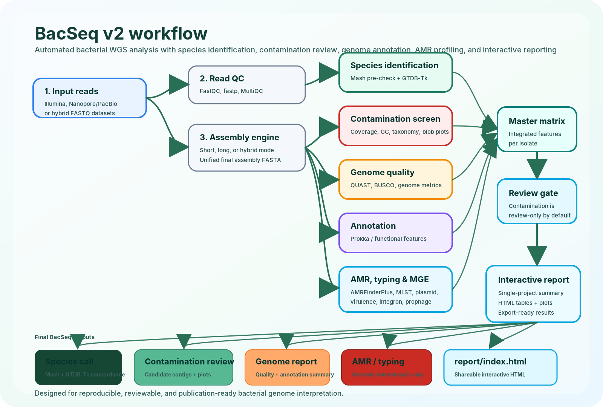

# BacSeq v2

<p align="center">
  
</p>

<h2 align="center">Automated bacterial whole-genome sequencing analysis with review-first contamination screening and interactive reporting</h2>

<p align="center">
  
  
  
  
  
</p>

---

## Why BacSeq v2?

**BacSeq v2** is a modular bacterial genome analysis workflow designed to transform raw bacterial WGS reads into a clear, reproducible, and shareable genome interpretation report.

The core idea is simple:

> **Identify the species first, screen contamination before interpretation, then generate an interactive report that researchers and clinicians can easily review.**

BacSeq v2 is especially suitable for bacterial isolate WGS projects involving species confirmation, assembly quality assessment, AMR gene screening, plasmid/virulence marker detection, MLST, and publication-ready genome summaries.

> **Important:** BacSeq v2 provides genomic interpretation only. AMR results should not replace phenotypic antimicrobial susceptibility testing or local clinical decision-making.

---

## Key features

| Feature | Description |
|---|---|
| **Species-first analysis** | Rapid Mash pre-check followed by GTDB-Tk genome-level classification |
| **Review-first contamination screening** | Candidate contaminant contigs are reported before any removal decision |
| **Flexible assembly mode** | Supports short-read, long-read, and hybrid assembly design |
| **Genome quality summary** | Assembly metrics, completeness, contamination indicators, and quality flags |
| **Annotation and feature profiling** | Prokka/functional annotation, AMR, MLST, plasmid, virulence, MGE, prophage, and optional CAZyme modules |
| **Interactive HTML report** | Shareable project-level report with summary cards, plots, and result tables |
| **Snakemake backend** | Reproducible, resumable, and scalable execution on workstation or HPC |
| **Automatic database setup** | `bacseq setup-db` prepares paths and database profiles for users |

---

## Workflow overview

<p align="center">
  
</p>

BacSeq v2 follows a **reviewable analysis model**. Contamination candidates are flagged and summarized, but the default policy is not to remove contigs automatically.

```yaml
contamination_policy: "review_only"
run_auto_decontam: false
```

This protects biologically important plasmids, prophages, and mobile genetic elements from accidental removal.

---

## Recommended repository layout

```text
BacSeq-v2/
├── bin/
│   └── bacseq
├── Snakefile
├── config/
│   ├── config.template.yaml
│   └── config.yaml
├── envs/
│   ├── bacseq_core.yaml
│   └── database_tools.yaml
├── scripts/
│   ├── setup_databases.sh
│   ├── update_config_paths.py
│   └── check_databases.py
├── report/
│   └── templates/
│       └── report.html.j2
├── docs/
│   ├── INSTALL_DATABASES.md
│   ├── WORKFLOW.md
│   └── assets/
│       ├── bacseq_v2_workflow.png
│       └── bacseq_v2_workflow.svg
└── README.md
```

---

## Installation

### 1. Clone BacSeq v2

```bash
git clone https://github.com/komwits-dev/BacSeq2.git
cd BacSeq-v2
```

### 2. Create the BacSeq environment

Using **mamba** is recommended.

```bash
mamba env create -f envs/bacseq_core.yaml
conda activate bacseq_v2_core
```

If `mamba` is not installed:

```bash
conda install -n base -c conda-forge mamba -y
```

### 3. Check the launcher

```bash
chmod +x bin/bacseq scripts/*.sh scripts/*.py
bin/bacseq help
```

Expected commands:

```text
init
setup-db
check-db
dry-run
run
help
```

---

## Quick start

### Step 1. Create a config file

```bash
bin/bacseq init
```

This creates:

```text
config/config.yaml
```

Edit the basic settings:

```yaml
input_dir: "fastq"
output_dir: "results"
mode: "short"
threads: 16
memory_gb: 64
```

---

### Step 2. Prepare input FASTQ files

For paired-end Illumina reads:

```text
fastq/
├── Sample01_R1.fastq.gz
├── Sample01_R2.fastq.gz
├── Sample02_R1.fastq.gz
└── Sample02_R2.fastq.gz
```

Supported naming examples:

```text
Sample_R1.fastq.gz / Sample_R2.fastq.gz
Sample_1.fastq.gz  / Sample_2.fastq.gz
Sample_R1_001.fastq.gz / Sample_R2_001.fastq.gz
```

---

### Step 3. Set up databases automatically

For most bacterial WGS projects, use the **standard** database profile:

```bash
bin/bacseq setup-db \
  --db-dir ~/bacseq_db \
  --profile standard \
  --threads 16 \
  --config config/config.yaml
```

Activate database environment variables:

```bash
source ~/bacseq_db/activate_bacseq_db.sh
```

Check database paths:

```bash
bin/bacseq check-db --config config/config.yaml
```

---

### Step 4. Dry run

Always test the workflow before running analysis:

```bash
bin/bacseq dry-run \
  --config config/config.yaml \
  --cores 16
```

---

### Step 5. Run BacSeq v2

```bash
bin/bacseq run \
  --config config/config.yaml \
  --cores 16
```

If the run is interrupted, simply run the same command again. Snakemake will continue from completed steps whenever possible.

---

## Database profiles

| Profile | Best for | Main content |
|---|---|---|
| `minimal` | Testing the launcher and config structure | Placeholder folders and path setup |
| `standard` | Routine bacterial WGS analysis | Mash, GTDB-Tk, Kraken2, NCBI taxdump, AMRFinderPlus path setup |
| `full` | Publication-level genome characterization | Standard profile plus eggNOG, dbCAN, VFDB, PlasmidFinder, and PHASTEST folder |

### Minimal profile

```bash
bin/bacseq setup-db \
  --db-dir ~/bacseq_db \
  --profile minimal \
  --config config/config.yaml
```

### Standard profile

```bash
bin/bacseq setup-db \
  --db-dir ~/bacseq_db \
  --profile standard \
  --threads 16 \
  --config config/config.yaml
```

### Full profile

```bash
bin/bacseq setup-db \
  --db-dir ~/bacseq_db \
  --profile full \
  --threads 32 \
  --config config/config.yaml
```

> The full profile may require large storage capacity and long download time.

---

## Configuration example

```yaml
# Input/output
input_dir: "fastq"
output_dir: "results"
mode: "short"
threads: 16
memory_gb: 64

# Database settings managed by bacseq setup-db
database_dir: "/home/user/bacseq_db"
database_profile: "standard"

# Main modules
run_species: true
run_decontam_screen: true
run_auto_decontam: false
run_annotation: true
run_amr: true
run_mlst: true
run_plasmid: true
run_virulence: true
run_mge: true
run_prophage: false
run_cazyme: false
run_comparative: false

# Contamination policy
contamination_policy: "review_only"
minimum_contig_length: 500
minimum_contaminant_confidence: 0.90
```

---

## Sequencing modes

| Mode | Input type | Typical assembler design |
|---|---|---|
| `short` | Illumina paired-end reads | SPAdes-based assembly |
| `long` | Nanopore/PacBio reads | long-read assembly + polishing |
| `hybrid` | Illumina + Nanopore/PacBio | hybrid assembly / polishing workflow |

All modes should produce one unified downstream file:

```text
assembly/{sample}/final.fasta
```

---

## Expected output

```text
results/
├── qc/
├── trimmed/
├── assembly/
├── species/
├── contamination/
├── quast/
├── busco/
├── annotation/
├── amr/
├── mlst/
├── plasmids/
├── virulence/
├── mge/
├── comparative/
└── report/
    └── index.html
```

Open the final report:

```bash
firefox results/report/index.html
```

Or copy this file to another computer and open it in a web browser:

```text
results/report/index.html
```

---

## Report contents

The final HTML report is designed to include:

| Section | Content |
|---|---|
| Project overview | Sample names, run settings, database profile, pipeline version |
| Species identification | Mash pre-check, GTDB-Tk classification, concordance warning |
| Assembly quality | Contig number, N50, genome size, GC content, BUSCO/QUAST metrics |
| Contamination screening | Candidate contaminant contigs, taxonomy, coverage, GC, review status |
| Genome annotation | CDS, rRNA, tRNA, functional summary |
| AMR profile | AMR genes, resistance-associated mutations, genomic determinants |
| Typing | MLST and species-specific typing when available |
| Plasmid/virulence/MGE | Plasmid markers, virulence genes, integrons, prophage, mobile elements |
| Export tables | TSV/JSON/HTML-ready summaries |

---

## Contamination policy

BacSeq v2 separates **screening** from **removal**.

### Default mode: review-only

```yaml
contamination_policy: "review_only"
run_auto_decontam: false
```

Generated files may include:

```text
candidate_contaminants.tsv
contamination_summary.tsv
contig_taxonomy.tsv
contig_coverage.tsv
blob_style_plot.html
```

### Optional strict mode

```yaml
contamination_policy: "strict"
run_auto_decontam: true
minimum_contaminant_confidence: 0.90
```

Strict mode should preserve removed contigs:

```text
filtered_assembly.fasta
quarantine_contigs.fasta
removed_contigs.tsv
```

---

## Common commands

| Task | Command |
|---|---|
| Show help | `bin/bacseq help` |
| Create config | `bin/bacseq init` |
| Standard database setup | `bin/bacseq setup-db --db-dir ~/bacseq_db --profile standard --threads 16 --config config/config.yaml` |
| Check database paths | `bin/bacseq check-db --config config/config.yaml` |
| Dry run | `bin/bacseq dry-run --config config/config.yaml --cores 16` |
| Run workflow | `bin/bacseq run --config config/config.yaml --cores 16` |
| Resume workflow | Re-run the same `bin/bacseq run` command |

---

## Complete example

```bash
# 1. Clone repository
git clone https://github.com/YOUR_USERNAME/BacSeq-v2.git
cd BacSeq-v2

# 2. Create environment
mamba env create -f envs/bacseq_core.yaml
conda activate bacseq_v2_core

# 3. Initialize config
bin/bacseq init

# 4. Copy FASTQ files
mkdir -p fastq
cp /path/to/*_R1*.fastq.gz fastq/
cp /path/to/*_R2*.fastq.gz fastq/

# 5. Set up databases
bin/bacseq setup-db \
  --db-dir ~/bacseq_db \
  --profile standard \
  --threads 16 \
  --config config/config.yaml

# 6. Activate database variables
source ~/bacseq_db/activate_bacseq_db.sh

# 7. Check database paths
bin/bacseq check-db --config config/config.yaml

# 8. Test workflow
bin/bacseq dry-run --config config/config.yaml --cores 16

# 9. Run workflow
bin/bacseq run --config config/config.yaml --cores 16
```

---

## Troubleshooting

<details>
<summary><b>snakemake: command not found</b></summary>

Activate the BacSeq environment:

```bash
conda activate bacseq_v2_core
```

</details>

<details>
<summary><b>GTDBTK_DATA_PATH is not set</b></summary>

Run:

```bash
source ~/bacseq_db/activate_bacseq_db.sh
```

Or manually export:

```bash
export GTDBTK_DATA_PATH="$HOME/bacseq_db/gtdbtk/gtdbtk_data"
```

</details>

<details>
<summary><b>Database check reports missing files</b></summary>

Check paths:

```bash
bin/bacseq check-db --config config/config.yaml
```

Then re-run setup:

```bash
bin/bacseq setup-db \
  --db-dir ~/bacseq_db \
  --profile standard \
  --threads 16 \
  --config config/config.yaml
```

</details>

<details>
<summary><b>Workflow stopped halfway</b></summary>

Run the same command again:

```bash
bin/bacseq run --config config/config.yaml --cores 16
```

Snakemake will resume from available completed outputs.

</details>

<details>
<summary><b>Conda environment solving is slow</b></summary>

Install and use mamba:

```bash
conda install -n base -c conda-forge mamba -y
```

</details>

---

## Development roadmap

- [ ] Add small public test dataset
- [ ] Add GitHub Actions validation
- [ ] Add offline self-contained report assets
- [ ] Add species-specific typing router
- [ ] Add Bioconda recipe after end-to-end tests
- [ ] Add Java GUI mode that writes `config.yaml` and launches Snakemake

---

## Citation

If you use BacSeq v2 in a publication, please cite the BacSeq v2 GitHub repository and the final software paper when available.

Suggested wording:

```text
Bacterial genome analysis was performed using BacSeq v2, a Snakemake-based workflow for bacterial WGS quality control, species identification, contamination screening, genome annotation, AMR profiling, and interactive reporting.
```

---

## License

MIT License

---

## Contact

For questions, bug reports, or feature requests, please open a GitHub Issue.
