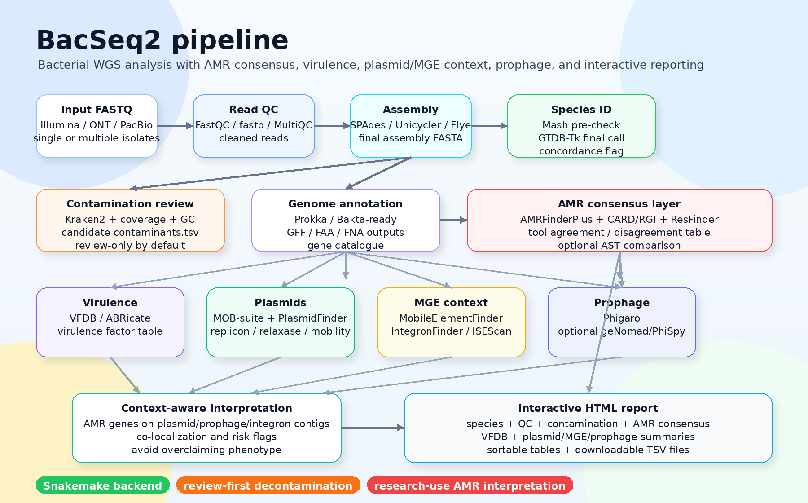

<p align="center">
  <h1 align="center">BacSeq2</h1>
  <p align="center">
    <b>Automated bacterial whole-genome sequencing analysis with species identification, contamination review, AMR consensus, virulence screening, plasmid/MGE context, prophage detection, and interactive HTML reporting.</b>
  </p>
</p>

<p align="center">
  
  
  
  
  
</p>

<p align="center">
  
</p>

---

## Overview

**BacSeq2** is a modular bacterial genome analysis workflow for routine bacterial WGS, research-grade genome characterization, and publication-ready reporting.

The updated BacSeq2 design adds a **multi-tool interpretation layer** instead of relying on a single database or software output. This is especially important for AMR, virulence, plasmids, mobile genetic elements, and prophages.

Major goals:

- Identify species before interpretation using **Mash** and **GTDB-Tk**.
- Detect possible contamination before downstream interpretation.
- Compare AMR evidence from **AMRFinderPlus**, **CARD/RGI**, and **ResFinder**.
- Screen virulence genes using **VFDB**.
- Characterize plasmids with **MOB-suite** and optional **PlasmidFinder**.
- Detect mobile genetic elements using **MobileElementFinder**, **IntegronFinder**, and **ISEScan**.
- Detect prophages using **Phigaro**, with optional **geNomad/PhiSpy** as future modules.
- Generate an interactive HTML report with sortable tables and module summaries.

> **Important:** BacSeq2 is a research workflow. Genomic AMR outputs should be reported as *predicted AMR determinants* and should not replace phenotypic antimicrobial susceptibility testing or local clinical interpretation.

---

## Key modules

| Category | Main tools | Output |
|---|---|---|
| Read QC | FastQC, fastp, MultiQC | read quality summary, trimmed reads |
| Assembly | SPAdes, Unicycler, Flye-ready | final assembly FASTA |
| Species ID | Mash, GTDB-Tk | read-level pre-check, genome-level taxonomy, concordance flag |
| Contamination review | Kraken2, coverage/GC summaries | candidate contaminants, review tables, blob-style plots |
| Annotation | Prokka/Bakta-ready | GFF, FAA, FNA, gene table |
| AMR consensus | AMRFinderPlus, CARD/RGI, ResFinder | merged AMR table, tool agreement, disagreement flags |
| Virulence | VFDB via BLAST/DIAMOND or ABRicate | virulence factor table |
| Plasmids | MOB-suite, PlasmidFinder optional | plasmid reconstruction, replicon/relaxase/mobility |
| Mobile elements | MobileElementFinder, IntegronFinder, ISEScan | MGEs, integrons, insertion sequences |
| Prophage | Phigaro; optional geNomad/PhiSpy | prophage regions, prophage maps |
| Report | Jinja2 + Plotly/DataTables-ready | `results/report/index.html` |

---

## Installation

### 1. Clone the repository

```bash
git clone https://github.com/komwits-dev/BacSeq2.git
cd BacSeq2
```

### 2. Configure Bioconda channels

```bash
conda config --add channels conda-forge
conda config --add channels bioconda
conda config --set channel_priority strict
```

### 3. Install mamba

```bash
conda install -n base -c conda-forge mamba -y
```

### 4. Create the main BacSeq2 environment

```bash
mamba env create -f envs/bacseq_core.yaml
conda activate bacseq_v2_core
```

### 5. Create the AMR/MGE module environment

```bash
mamba env create -f envs/amr_mge.yaml
```

If environment solving fails because of optional tools, use the fallback command:

```bash
mamba create -n bacseq_amr_mge \
  -c conda-forge -c bioconda \
  python=3.11 pandas pyyaml biopython blast diamond hmmer prodigal seqkit samtools bedtools \
  ncbi-amrfinderplus rgi resfinder abricate mob_suite integron_finder isescan phigaro genomad \
  pip -y

conda activate bacseq_amr_mge
pip install MobileElementFinder
conda deactivate
```

### 6. Check the launcher

```bash
conda activate bacseq_v2_core
chmod +x bin/bacseq scripts/*.sh scripts/*.py
bin/bacseq help
```

Expected commands:

```text
init
setup-db
check-db
dry-run
run
help
```

---

## Recommended installation using a large disk

If your home directory has limited space, place databases, conda environments, and results on a large disk.

Example for your workstation:

```bash
mkdir -p /media/mecob/komwit/BacSeq2 \
         /media/mecob/komwit/BacSeq_DB \
         /media/mecob/komwit/BacSeq_Conda_Envs \
         /media/mecob/komwit/BacSeq_Results

cd /media/mecob/komwit/BacSeq2

git clone https://github.com/komwits-dev/BacSeq2.git
cd BacSeq2

conda config --add channels conda-forge
conda config --add channels bioconda
conda config --set channel_priority strict
conda install -n base -c conda-forge mamba -y

mamba env create -f envs/bacseq_core.yaml
mamba env create -f envs/amr_mge.yaml

conda activate bacseq_v2_core
chmod +x bin/bacseq scripts/*.sh scripts/*.py
bin/bacseq init
```

---

## Database setup

BacSeq2 uses database profiles so users do not need to download everything for every analysis.

| Profile | Best for | Includes |
|---|---|---|
| `minimal` | workflow testing | folder setup and config paths only |
| `standard` | routine bacterial WGS | Mash path, GTDB-Tk, Kraken2, taxdump, AMRFinderPlus |
| `full` | publication-level report | standard + CARD/RGI, ResFinder, VFDB, MOB-suite, PlasmidFinder, MobileElementFinder-ready folders, Phigaro/geNomad-ready folders, eggNOG/dbCAN optional |

### Standard database setup

```bash
conda activate bacseq_v2_core

bin/bacseq setup-db \
  --db-dir /media/mecob/komwit/BacSeq_DB \
  --profile standard \
  --threads 16 \
  --config config/config.yaml
```

### Full AMR/MGE database setup

```bash
conda activate bacseq_v2_core

bin/bacseq setup-amr-mge-db \
  --db-dir /media/mecob/komwit/BacSeq_DB \
  --threads 16 \
  --config config/config.yaml
```

Then activate database variables:

```bash
source /media/mecob/komwit/BacSeq_DB/activate_bacseq_db.sh
```

Make the path permanent:

```bash
echo 'export BACSEQ_DB="/media/mecob/komwit/BacSeq_DB"' >> ~/.bashrc
echo 'export GTDBTK_DATA_PATH="/media/mecob/komwit/BacSeq_DB/gtdbtk/gtdbtk_data"' >> ~/.bashrc
source ~/.bashrc
```

Check database paths:

```bash
bin/bacseq check-db --config config/config.yaml
```

---

## Configuration

Main config file:

```text
config/config.yaml
```

Core settings:

```yaml
input_dir: "fastq"
output_dir: "/media/mecob/komwit/BacSeq_Results"
mode: "short"
threads: 16
memory_gb: 64

database_dir: "/media/mecob/komwit/BacSeq_DB"
database_profile: "full"
```

Recommended module switches:

```yaml
# Species and QC
run_species: true
run_decontam_screen: true
run_auto_decontam: false
run_annotation: true
run_mlst: true

# AMR comparison layer
run_amr: true
run_amrfinderplus: true
run_card_rgi: true
run_resfinder: true
run_amr_consensus: true

# Virulence, plasmids, mobile elements, phage
run_virulence: true
run_vfdb: true
run_plasmid: true
run_mob_suite: true
run_plasmidfinder: true
run_mge: true
run_mobileelementfinder: true
run_integronfinder: true
run_isescan: true
run_prophage: true
run_phigaro: true
run_genomad: false

# Optional functional modules
run_cazyme: false
run_comparative: false
```

Database paths automatically managed by setup scripts:

```yaml
amrfinder_db: "/media/mecob/komwit/BacSeq_DB/amrfinderplus"
card_rgi_db: "/media/mecob/komwit/BacSeq_DB/card_rgi"
resfinder_db: "/media/mecob/komwit/BacSeq_DB/resfinder_db"
pointfinder_db: "/media/mecob/komwit/BacSeq_DB/pointfinder_db"
vfdb_nt: "/media/mecob/komwit/BacSeq_DB/vfdb/VFDB_setB_nt.fas"
vfdb_prot: "/media/mecob/komwit/BacSeq_DB/vfdb/VFDB_setB_pro.fas"
mob_suite_db: "/media/mecob/komwit/BacSeq_DB/mob_suite"
plasmidfinder_db: "/media/mecob/komwit/BacSeq_DB/plasmidfinder_db"
mefinder_db: "/media/mecob/komwit/BacSeq_DB/mobileelementfinder"
phigaro_db: "/media/mecob/komwit/BacSeq_DB/phigaro"
genomad_db: "/media/mecob/komwit/BacSeq_DB/genomad"
```

---

## Input files

For paired-end Illumina reads:

```text
fastq/
├── Sample01_R1.fastq.gz
├── Sample01_R2.fastq.gz
├── Sample02_R1.fastq.gz
└── Sample02_R2.fastq.gz
```

Supported naming patterns:

```text
Sample_R1.fastq.gz / Sample_R2.fastq.gz
Sample_1.fastq.gz  / Sample_2.fastq.gz
Sample_R1_001.fastq.gz / Sample_R2_001.fastq.gz
```

---

## Run BacSeq2

### Dry run

```bash
conda activate bacseq_v2_core
source /media/mecob/komwit/BacSeq_DB/activate_bacseq_db.sh

bin/bacseq dry-run \
  --config config/config.yaml \
  --cores 16 \
  --conda-prefix /media/mecob/komwit/BacSeq_Conda_Envs
```

### Real run

```bash
bin/bacseq run \
  --config config/config.yaml \
  --cores 16 \
  --conda-prefix /media/mecob/komwit/BacSeq_Conda_Envs
```

For a high-core server:

```bash
bin/bacseq run \
  --config config/config.yaml \
  --cores 48 \
  --conda-prefix /media/mecob/komwit/BacSeq_Conda_Envs
```

---

## Individual module commands

These commands are useful for testing each module before connecting it to Snakemake.

### AMRFinderPlus

```bash
amrfinder_update --database /media/mecob/komwit/BacSeq_DB/amrfinderplus

amrfinder \
  --nucleotide results/assembly/Sample01/final.fasta \
  --database /media/mecob/komwit/BacSeq_DB/amrfinderplus \
  --output results/amr/Sample01/amrfinderplus.tsv \
  --threads 16
```

### CARD/RGI

```bash
rgi main \
  --input_sequence results/assembly/Sample01/final.fasta \
  --output_file results/amr/Sample01/card_rgi \
  --input_type contig \
  --local \
  --clean \
  --num_threads 16
```

### ResFinder

```bash
run_resfinder.py \
  -ifa results/assembly/Sample01/final.fasta \
  -o results/amr/Sample01/resfinder \
  -s "Other" \
  -db_res /media/mecob/komwit/BacSeq_DB/resfinder_db \
  -acq
```

For species with PointFinder support, replace `"Other"` with the correct species name and add the point mutation database:

```bash
run_resfinder.py \
  -ifa results/assembly/Sample01/final.fasta \
  -o results/amr/Sample01/resfinder \
  -s "Escherichia coli" \
  -db_res /media/mecob/komwit/BacSeq_DB/resfinder_db \
  -db_point /media/mecob/komwit/BacSeq_DB/pointfinder_db \
  -acq -c
```

### VFDB virulence screening

Using ABRicate:

```bash
abricate \
  --db vfdb \
  results/assembly/Sample01/final.fasta \
  > results/virulence/Sample01/vfdb_abricate.tsv
```

Using DIAMOND against VFDB protein database:

```bash
diamond blastx \
  --query results/assembly/Sample01/final.fasta \
  --db /media/mecob/komwit/BacSeq_DB/vfdb/VFDB_setB_pro.dmnd \
  --out results/virulence/Sample01/vfdb_diamond.tsv \
  --outfmt 6 qseqid sseqid pident length qlen slen evalue bitscore stitle \
  --threads 16
```

### MOB-suite plasmid reconstruction and typing

```bash
mob_init -d /media/mecob/komwit/BacSeq_DB/mob_suite

mob_recon \
  --infile results/assembly/Sample01/final.fasta \
  --outdir results/plasmids/Sample01/mob_recon \
  --num_threads 16
```

### PlasmidFinder

```bash
plasmidfinder.py \
  -i results/assembly/Sample01/final.fasta \
  -o results/plasmids/Sample01/plasmidfinder \
  -p /media/mecob/komwit/BacSeq_DB/plasmidfinder_db \
  -x
```

### MobileElementFinder / MEFinder

```bash
mefinder find \
  --contig results/assembly/Sample01/final.fasta \
  results/mge/Sample01/mobileelementfinder
```

### IntegronFinder

```bash
integron_finder \
  results/assembly/Sample01/final.fasta \
  --outdir results/mge/Sample01/integronfinder \
  --cpu 16
```

### ISEScan

```bash
isescan.py \
  --seqfile results/assembly/Sample01/final.fasta \
  --output results/mge/Sample01/isescan \
  --nthread 16
```

### Phigaro prophage detection

```bash
phigaro \
  -f results/assembly/Sample01/final.fasta \
  -o results/prophage/Sample01/phigaro \
  -p \
  --not-open
```

### Optional geNomad virus/plasmid detection

```bash
genomad download-database /media/mecob/komwit/BacSeq_DB/genomad

genomad end-to-end \
  results/assembly/Sample01/final.fasta \
  results/mge/Sample01/genomad \
  /media/mecob/komwit/BacSeq_DB/genomad \
  --threads 16
```

---

## AMR consensus interpretation

BacSeq2 should not simply concatenate AMR outputs. The recommended interpretation is a consensus table:

```text
sample
contig
start
end
gene_or_mutation
antimicrobial_class
drug
mechanism
amrfinderplus_hit
card_rgi_hit
resfinder_hit
identity
coverage
prediction_confidence
notes
```

Suggested confidence labels:

| Label | Definition |
|---|---|
| `high_confidence` | detected by AMRFinderPlus and at least one of CARD/RGI or ResFinder, or exact curated hit |
| `tool_specific` | detected by one tool only; keep but flag for review |
| `mutation_call` | resistance-associated mutation; interpret species-dependently |
| `low_identity_or_partial` | below identity/coverage thresholds; do not overinterpret |

Recommended report wording:

```text
Genomic AMR determinants were predicted using AMRFinderPlus, CARD/RGI, and ResFinder. Hits supported by multiple tools were prioritized as high-confidence genomic AMR determinants. These genomic predictions should be interpreted together with phenotypic AST data when clinical interpretation is required.
```

---

## Report structure

The HTML report should contain these sections:

1. Sample overview
2. Species identification and concordance warning
3. Read QC and assembly QC
4. Contamination review
5. Annotation summary
6. AMR consensus summary
7. AMR tool comparison
8. Virulence factors from VFDB
9. Plasmid reconstruction and plasmid typing
10. Mobile genetic elements
11. Prophage regions
12. AMR context summary
13. Downloadable tables

Expected report outputs:

```text
results/report/index.html
results/report/tables/amr_consensus.tsv
results/report/tables/amrfinderplus.tsv
results/report/tables/card_rgi.tsv
results/report/tables/resfinder.tsv
results/report/tables/vfdb.tsv
results/report/tables/mob_suite.tsv
results/report/tables/plasmidfinder.tsv
results/report/tables/mobileelementfinder.tsv
results/report/tables/integronfinder.tsv
results/report/tables/isescan.tsv
results/report/tables/phigaro.tsv
```

---

## Expected output folder

```text
results/
├── qc/
├── trimmed/
├── assembly/
├── species/
├── contamination/
├── annotation/
├── amr/
│   └── Sample01/
│       ├── amrfinderplus.tsv
│       ├── card_rgi.txt
│       ├── resfinder/
│       └── amr_consensus.tsv
├── virulence/
│   └── Sample01/
│       └── vfdb_abricate.tsv
├── plasmids/
│   └── Sample01/
│       ├── mob_recon/
│       └── plasmidfinder/
├── mge/
│   └── Sample01/
│       ├── mobileelementfinder/
│       ├── integronfinder/
│       ├── isescan/
│       └── genomad/
├── prophage/
│   └── Sample01/
│       └── phigaro/
└── report/
    ├── index.html
    └── tables/
```

---

## Tools recommended for future BacSeq2 improvement

| Priority | Tool/module | Why include it? |
|---|---|---|
| Very high | **Bakta** | modern bacterial annotation alternative to Prokka; useful for standardized annotation outputs |
| Very high | **Kleborate** | excellent for *Klebsiella* species complex: virulence, resistance, K/O typing, MLST |
| Very high | **Kaptive** | capsule/O-antigen typing for *Klebsiella* and *Acinetobacter* |
| Very high | **SeqSero2** | *Salmonella* serotype prediction |
| High | **ECTyper** | *E. coli* serotype prediction |
| High | **SISTR** | *Salmonella* typing and serovar prediction |
| High | **SCCmecFinder/spaTyper** | important for *Staphylococcus aureus* |
| High | **Kleborate + MOB-suite AMR context** | useful for linking resistance and plasmid context in Enterobacterales |
| High | **geNomad** | fast virus/plasmid/provirus identification; good complement to Phigaro/MOB-suite |
| High | **PhiSpy** | useful second prophage caller, especially for bacterial isolate genomes |
| High | **IntegronFinder** | integrons are important AMR mobilization structures |
| High | **ISEScan** | insertion sequence detection and transposase-rich genome interpretation |
| Medium | **Panaroo/PIRATE** | pangenome comparison when multiple isolates are provided |
| Medium | **Snippy/cgSNP pipeline** | outbreak/cluster SNP analysis |
| Medium | **fastANI/skani** | fast genome identity and outlier checking |
| Medium | **CheckM2/GUNC** | genome quality and contamination checks for large/public datasets |
| Medium | **MLST + chewBBACA/cgMLST** | standardized typing for outbreak collections |

Recommended development order:

```text
1. Make AMRFinderPlus + CARD/RGI + ResFinder consensus stable.
2. Add VFDB virulence table.
3. Add MOB-suite plasmid module.
4. Add MobileElementFinder + IntegronFinder + ISEScan MGE module.
5. Add Phigaro prophage module.
6. Add AMR-context integration: AMR genes on plasmid/prophage/integron contigs.
7. Add species-specific router: Kleborate/Kaptive/SeqSero2/ECTyper/SISTR/spaTyper.
8. Add multi-isolate comparative mode: Mash/fastANI/SNP/pangenome.
```

---

## Troubleshooting

### Home directory has no space

Use a large disk:

```bash
bin/bacseq setup-db \
  --db-dir /media/mecob/komwit/BacSeq_DB \
  --profile full \
  --threads 16 \
  --config config/config.yaml
```

Run Snakemake with a conda prefix outside Home:

```bash
bin/bacseq run \
  --config config/config.yaml \
  --cores 16 \
  --conda-prefix /media/mecob/komwit/BacSeq_Conda_Envs
```

### CARD/RGI database is missing

CARD may require manual download/registration depending on the release route. Download the official CARD data, then run:

```bash
rgi load --card_json /path/to/card.json --local
```

### ResFinder species error

Use `-s "Other"` for acquired gene-only detection, or provide a supported species name if using PointFinder mutation detection.

### Plasmid/MGE results are empty

Short-read draft assemblies may fragment plasmids and MGEs. Use hybrid assembly or long-read data when plasmid reconstruction is biologically important.

---

## Citation note

Please cite BacSeq2 and the individual tools/databases used in your analysis report. At minimum, report the versions and database release dates for:

```text
AMRFinderPlus database
CARD/RGI database
ResFinder database
VFDB release/download date
MOB-suite database
MobileElementFinder version/database
Phigaro version/database
GTDB-Tk release
Kraken2 database date
```

---

## License

Add your preferred license here, for example:

```text
MIT License
```

---

## Contact

For questions, bug reports, or feature requests, please open a GitHub Issue.
