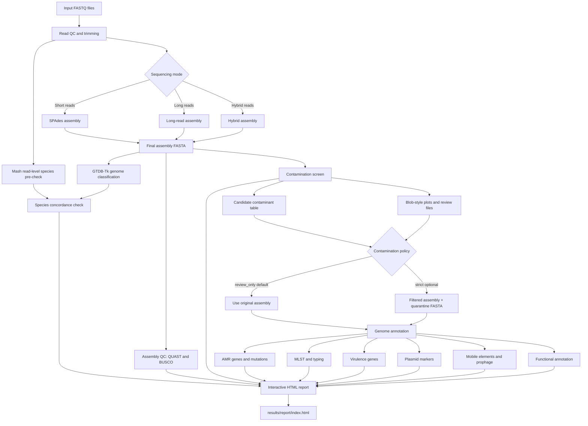

<p align="center">
  <h1 align="center">BacSeq v2</h1>
  <p align="center">
    <b>Automated bacterial whole-genome sequencing analysis with species identification, contamination screening, AMR profiling, and interactive HTML reporting.</b>
  </p>
</p>

<p align="center">
  
  
  
  
</p>

---

## Overview

**BacSeq v2** is a modular bacterial genome analysis workflow designed for routine bacterial whole-genome sequencing, research-grade genome characterization, and publication-ready reporting.

The major goals of BacSeq v2 are:

- **Identify species before interpretation** using fast read-level screening and genome-level classification.
- **Detect possible contamination** before downstream analysis.
- **Generate a clear single-sample report** that can be shared with collaborators or clinicians.
- **Use Snakemake as the workflow engine** for resumability, reproducibility, and parallel execution.
- **Keep the user interface simple** through a lightweight `bacseq` launcher.

> **Important:** BacSeq v2 is currently designed as a research and development workflow. Genomic AMR results should not be used as the sole basis for clinical treatment decisions without phenotypic AST and local clinical interpretation.

---

## Key features

| Module | Purpose |
|---|---|
| Read QC | FASTQ quality control, adapter trimming, and summary reports |
| Genome assembly | Short-read, long-read, or hybrid bacterial genome assembly |
| Species identification | Rapid Mash pre-check and genome-based GTDB-Tk classification |
| Contamination screening | Candidate contaminant detection with a review-first policy |
| Assembly QC | QUAST/BUSCO-based genome quality summary |
| Annotation | Structural and functional genome annotation |
| AMR profiling | Detection of antimicrobial resistance genes and mutations |
| Typing | MLST and optional species-specific typing modules |
| Plasmid/virulence/MGE screening | Detection of plasmid markers, virulence genes, and mobile genetic elements |
| HTML report | Interactive and portable report for each isolate/project |

---

## How BacSeq v2 works



### Design principle

BacSeq v2 uses a **review-first contamination strategy**. By default, suspicious contigs are reported but not removed:

```yaml
contamination_policy: "review_only"
run_auto_decontam: false
```

This is safer because plasmids, prophages, and mobile genetic elements can be biologically important and should not be automatically discarded.

---

## Recommended folder structure

```text
BacSeq2/
├── bin/
│   └── bacseq
├── Snakefile
├── config/
│   ├── config.template.yaml
│   └── config.yaml
├── scripts/
│   ├── setup_databases.sh
│   ├── update_config_paths.py
│   └── check_databases.py
├── envs/
│   ├── bacseq_core.yaml
│   └── database_tools.yaml
├── docs/
│   └── INSTALL_DATABASES.md
├── report/
│   └── templates/
│       └── report.html.j2
└── README.md
```

---

## Installation

### 1. Clone the repository

```bash
git clone https://github.com/komwits-dev/BacSeq2.git
cd BacSeq2
```

### 2. Create the BacSeq conda environment

Using **mamba** is recommended:

```bash
mamba env create -f envs/bacseq_core.yaml
conda activate bacseq_v2_core
```

If you do not have `mamba`, install it first:

```bash
conda install -n base -c conda-forge mamba -y
```

### 3. Check the BacSeq launcher

```bash
chmod +x bin/bacseq scripts/*.sh scripts/*.py
bin/bacseq help
```

Expected commands:

```text
init
setup-db
check-db
dry-run
run
help
```

---

## Quick start

### Step 1: Create a config file

```bash
bin/bacseq init
```

This creates:

```text
config/config.yaml
```

Edit only the simple input/output settings first:

```yaml
input_dir: "fastq"
output_dir: "results"
mode: "short"
threads: 16
memory_gb: 64
```

---

### Step 2: Prepare input files

For paired-end Illumina reads, place FASTQ files in the input folder:

```text
fastq/
├── Sample01_R1.fastq.gz
├── Sample01_R2.fastq.gz
├── Sample02_R1.fastq.gz
└── Sample02_R2.fastq.gz
```

Recommended naming patterns:

```text
Sample_R1.fastq.gz / Sample_R2.fastq.gz
Sample_1.fastq.gz  / Sample_2.fastq.gz
Sample_R1_001.fastq.gz / Sample_R2_001.fastq.gz
```

---

### Step 3: Set up databases automatically

For most users, use the **standard** profile:

```bash
bin/bacseq setup-db \
  --db-dir ~/bacseq_db \
  --profile standard \
  --threads 16 \
  --config config/config.yaml
```

Then activate database paths:

```bash
source ~/bacseq_db/activate_bacseq_db.sh
```

Check whether the database paths are configured correctly:

```bash
bin/bacseq check-db --config config/config.yaml
```

---

### Step 4: Test the workflow

Always run a dry run before starting analysis:

```bash
bin/bacseq dry-run \
  --config config/config.yaml \
  --cores 16
```

If the dry run finishes without errors, start the analysis:

```bash
bin/bacseq run \
  --config config/config.yaml \
  --cores 16
```

---

## Database profiles

BacSeq v2 uses database profiles so users do not need to download every database for every use case.

| Profile | Best for | Includes |
|---|---|---|
| `minimal` | Testing the workflow structure | Small folders/placeholders and config path setup |
| `standard` | Routine bacterial WGS | Mash, GTDB-Tk, Kraken2, NCBI taxdump, AMRFinderPlus path setup |
| `full` | Publication-level genome report | Standard profile plus eggNOG, dbCAN, VFDB, PlasmidFinder, and PHASTEST folder |

### Minimal setup

Use this when you only want to test the launcher and workflow structure:

```bash
bin/bacseq setup-db \
  --db-dir ~/bacseq_db \
  --profile minimal \
  --config config/config.yaml
```

### Standard setup

Recommended for routine bacterial genome analysis:

```bash
bin/bacseq setup-db \
  --db-dir ~/bacseq_db \
  --profile standard \
  --threads 16 \
  --config config/config.yaml
```

### Full setup

Recommended for publication-level analysis:

```bash
bin/bacseq setup-db \
  --db-dir ~/bacseq_db \
  --profile full \
  --threads 32 \
  --config config/config.yaml
```

> The full profile can require large storage space and long download time.

---

## Configuration

Main configuration file:

```text
config/config.yaml
```

Example:

```yaml
# Input/output
input_dir: "fastq"
output_dir: "results"
mode: "short"
threads: 16
memory_gb: 64

# Database settings automatically managed by bacseq setup-db
database_dir: "/home/user/bacseq_db"
database_profile: "standard"

# Module switches
run_species: true
run_decontam_screen: true
run_auto_decontam: false
run_annotation: true
run_amr: true
run_mlst: true
run_plasmid: true
run_virulence: true
run_mge: true
run_prophage: false
run_cazyme: false
run_comparative: false

# Contamination policy
contamination_policy: "review_only"
minimum_contig_length: 500
minimum_contaminant_confidence: 0.90
```

---

## Sequencing modes

| Mode | Use case | Example config |
|---|---|---|
| `short` | Illumina paired-end reads | `mode: "short"` |
| `long` | Nanopore/PacBio reads | `mode: "long"` |
| `hybrid` | Illumina + Nanopore/PacBio reads | `mode: "hybrid"` |

> The workflow should route all assembly modes to one final assembly FASTA before downstream analysis.

---

## Expected output

```text
results/
├── qc/
├── trimmed/
├── assembly/
├── species/
├── contamination/
├── quast/
├── busco/
├── annotation/
├── amr/
├── mlst/
├── plasmids/
├── virulence/
├── mge/
├── comparative/
└── report/
    └── index.html
```

Open the final report:

```bash
firefox results/report/index.html
```

Or copy this file to another computer and open it in a web browser:

```text
results/report/index.html
```

---

## Report structure

The HTML report is designed to summarize:

1. Project/sample overview
2. Species identification
3. Species concordance warning
4. Assembly quality
5. Contamination screening
6. Genome annotation summary
7. AMR profile
8. MLST and typing
9. Plasmid markers
10. Virulence genes
11. Mobile genetic elements
12. Optional comparative genomics
13. Downloadable result tables

---

## Contamination interpretation

BacSeq v2 separates **screening** from **removal**.

### Default: review-only mode

```yaml
contamination_policy: "review_only"
run_auto_decontam: false
```

This mode generates:

```text
candidate_contaminants.tsv
contamination_summary.tsv
contig_taxonomy.tsv
contig_coverage.tsv
blob_style_plot.html
```

The user reviews the results before deciding whether contigs should be removed.

### Optional: strict removal mode

```yaml
contamination_policy: "strict"
run_auto_decontam: true
minimum_contaminant_confidence: 0.90
```

Strict mode should only remove high-confidence contaminant contigs and must preserve removed contigs in a quarantine file:

```text
filtered_assembly.fasta
quarantine_contigs.fasta
removed_contigs.tsv
```

---

## Common commands

| Task | Command |
|---|---|
| Show help | `bin/bacseq help` |
| Create config | `bin/bacseq init` |
| Set up standard databases | `bin/bacseq setup-db --db-dir ~/bacseq_db --profile standard --threads 16 --config config/config.yaml` |
| Check databases | `bin/bacseq check-db --config config/config.yaml` |
| Dry run | `bin/bacseq dry-run --config config/config.yaml --cores 16` |
| Run workflow | `bin/bacseq run --config config/config.yaml --cores 16` |
| Continue after interruption | Re-run the same `bin/bacseq run` command |

---

## Example complete run

```bash
# 1. Clone repository
git clone https://github.com/komwits-dev/BacSeq2.git
cd BacSeq2

# 2. Create environment
mamba env create -f envs/bacseq_core.yaml
conda activate bacseq_v2_core

# 3. Initialize config
bin/bacseq init

# 4. Copy FASTQ files
mkdir -p fastq
cp /path/to/*_R1*.fastq.gz fastq/
cp /path/to/*_R2*.fastq.gz fastq/

# 5. Set up databases
bin/bacseq setup-db \
  --db-dir ~/bacseq_db \
  --profile standard \
  --threads 16 \
  --config config/config.yaml

# 6. Activate database variables
source ~/bacseq_db/activate_bacseq_db.sh

# 7. Check database paths
bin/bacseq check-db --config config/config.yaml

# 8. Test workflow
bin/bacseq dry-run --config config/config.yaml --cores 16

# 9. Run workflow
bin/bacseq run --config config/config.yaml --cores 16
```

---

## Troubleshooting

### `snakemake: command not found`

Activate the BacSeq environment:

```bash
conda activate bacseq_v2_core
```

### `GTDBTK_DATA_PATH is not set`

Run:

```bash
source ~/bacseq_db/activate_bacseq_db.sh
```

Or manually export:

```bash
export GTDBTK_DATA_PATH="$HOME/bacseq_db/gtdbtk/gtdbtk_data"
```

### Database check reports missing files

Run:

```bash
bin/bacseq check-db --config config/config.yaml
```

Then re-run setup if needed:

```bash
bin/bacseq setup-db \
  --db-dir ~/bacseq_db \
  --profile standard \
  --threads 16 \
  --config config/config.yaml
```

### Workflow stopped halfway

BacSeq uses Snakemake. Re-run the same command:

```bash
bin/bacseq run --config config/config.yaml --cores 16
```

Snakemake will continue from completed files where possible.

### Conda environment solving is slow

Use mamba:

```bash
conda install -n base -c conda-forge mamba -y
```

Then re-run the workflow.

---

## Development notes

Recommended future improvements:

- Add a small public test dataset.
- Add GitHub Actions for basic command validation.
- Add offline self-contained HTML report assets.
- Add species-specific typing router after stable species identification.
- Add Bioconda recipe after the workflow passes end-to-end tests.
- Add Java GUI support where the GUI writes `config.yaml` and calls `bin/bacseq run`.

---

## Citation

If you use BacSeq v2 in a publication, please cite the BacSeq v2 GitHub repository and the final software paper when available.

Suggested wording:

```text
Bacterial genome analysis was performed using BacSeq v2, a Snakemake-based workflow for bacterial WGS quality control, species identification, contamination screening, genome annotation, AMR profiling, and interactive reporting.
```

---

## License

Add your preferred license here, for example:

```text
MIT License
```

---

## Contact

For questions, bug reports, or feature requests, please open a GitHub Issue.

