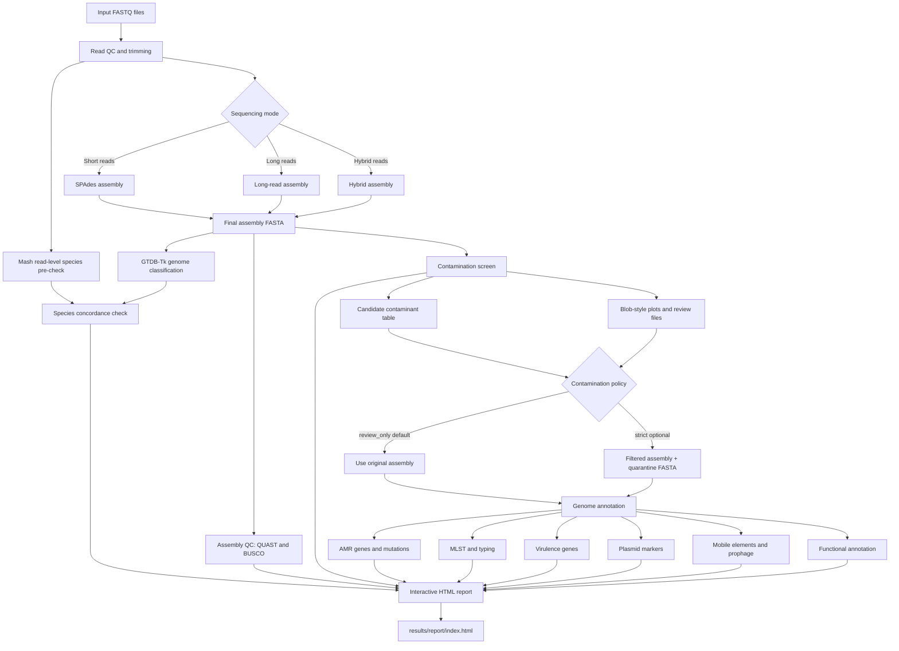

# BacSeq v2 workflow diagram

```mermaid
flowchart TD
    A[Input FASTQ files] --> B[Read QC and trimming]
    B --> C{Sequencing mode}
    C -->|Short reads| D1[SPAdes assembly]
    C -->|Long reads| D2[Long-read assembly]
    C -->|Hybrid reads| D3[Hybrid assembly]
    D1 --> E[Final assembly FASTA]
    D2 --> E
    D3 --> E
    B --> F1[Mash read-level species pre-check]
    E --> F2[GTDB-Tk genome classification]
    F1 --> F3[Species concordance check]
    F2 --> F3
    E --> G[Assembly QC: QUAST and BUSCO]
    E --> H[Contamination screen]
    H --> H1[Candidate contaminant table]
    H --> H2[Blob-style plots and review files]
    H1 --> I{Contamination policy}
    H2 --> I
    I -->|review_only default| J[Use original assembly]
    I -->|strict optional| K[Filtered assembly + quarantine FASTA]
    J --> L[Genome annotation]
    K --> L
    L --> M1[AMR genes and mutations]
    L --> M2[MLST and typing]
    L --> M3[Virulence genes]
    L --> M4[Plasmid markers]
    L --> M5[Mobile elements and prophage]
    L --> M6[Functional annotation]
    F3 --> N[Interactive HTML report]
    G --> N
    H --> N
    M1 --> N
    M2 --> N
    M3 --> N
    M4 --> N
    M5 --> N
    M6 --> N
    N --> O[results/report/index.html]
```
